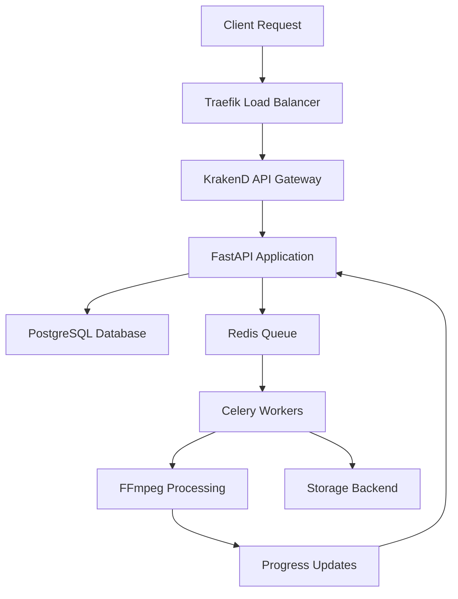

# 🤝 Contributing to FFmpeg API

> **A comprehensive guide for developers, video engineers, and FFmpeg experts**

Welcome to the FFmpeg API project! This guide is designed for contributors with various levels of FFmpeg expertise, from developers new to video processing to seasoned video engineers and FFmpeg power users.

## Table of Contents

1. [🎯 Who This Guide Is For](#-who-this-guide-is-for)
2. [🚀 Quick Start for Contributors](#-quick-start-for-contributors)
3. [🏗️ Project Architecture](#️-project-architecture)
4. [💻 Development Environment Setup](#-development-environment-setup)
5. [🎬 FFmpeg Integration Guidelines](#-ffmpeg-integration-guidelines)
6. [🔧 API Development Patterns](#-api-development-patterns)
7. [🧪 Testing & Quality Assurance](#-testing--quality-assurance)
8. [📊 Performance & Optimization](#-performance--optimization)
9. [🛡️ Security Considerations](#️-security-considerations)
10. [🐛 Debugging & Troubleshooting](#-debugging--troubleshooting)
11. [📝 Code Style & Standards](#-code-style--standards)
12. [🚢 Deployment & Production](#-deployment--production)
13. [📚 Learning Resources](#-learning-resources)
14. [🤝 Community Guidelines](#-community-guidelines)

## 🎯 Who This Guide Is For

### 👨‍💻 **Software Developers**
- New to video processing but experienced in Python/FastAPI
- Want to contribute to API endpoints, database models, or infrastructure
- **Focus Areas**: API design, async programming, database operations, containerization

### 🎬 **Video Engineers**
- Experienced with video processing workflows and codecs
- Understanding of transcoding, quality metrics, and streaming protocols
- **Focus Areas**: Video processing pipelines, quality analysis, codec optimization

### ⚡ **FFmpeg Power Users**
- Deep knowledge of FFmpeg command-line tools and options
- Experience with complex video processing workflows
- **Focus Areas**: FFmpeg wrapper improvements, hardware acceleration, filter chains

### 🤖 **AI/ML Engineers**
- Experience with video analysis and enhancement models
- Want to contribute to GenAI features
- **Focus Areas**: Model integration, GPU acceleration, quality enhancement

## 🚀 Quick Start for Contributors

### Prerequisites
```bash
# Required tools
- Python 3.12+
- Docker & Docker Compose
- Git
- FFmpeg 6.0+ (for local development)

# Optional for AI features
- NVIDIA GPU with CUDA support
- 16GB+ RAM for AI models
```

### 1. Fork & Clone
```bash
git clone https://github.com/your-username/ffmpeg-api.git
cd ffmpeg-api
git remote add upstream https://github.com/rendiffdev/ffmpeg-api.git
```

### 2. Development Setup
```bash
# Choose your development environment
./setup.sh --development    # Quick local setup
./setup.sh --interactive    # Guided setup with options
```

### 3. Verify Setup
```bash
# Check all services are running
./scripts/health-check.sh

# Run basic tests
python -m pytest tests/test_health.py -v

# Test API endpoints
curl -H "X-API-Key: dev-key" http://localhost:8000/api/v1/health
```

## 🏗️ Project Architecture

### Core Components

```
ffmpeg-api/
├── api/                    # FastAPI application
│   ├── routers/           # API endpoints
│   ├── models/            # Database models
│   ├── services/          # Business logic
│   ├── utils/             # Utilities
│   └── genai/             # AI-enhanced features
├── worker/                # Celery workers
│   ├── processors/        # Media processing logic
│   └── utils/             # FFmpeg wrappers
├── storage/               # Storage backends (S3, local, etc.)
├── docker/                # Container configurations
├── scripts/               # Management scripts
└── docs/                  # Documentation
```

### Technology Stack

| Component | Technology | Purpose |
|-----------|------------|---------|
| **API Framework** | FastAPI | REST API with async support |
| **Task Queue** | Celery + Redis | Background job processing |
| **Database** | PostgreSQL | Job metadata and state |
| **Media Processing** | FFmpeg 6.0 | Core video/audio processing |
| **Containerization** | Docker | Deployment and isolation |
| **Load Balancer** | Traefik | SSL termination and routing |
| **API Gateway** | KrakenD | Rate limiting and middleware |
| **Monitoring** | Prometheus + Grafana | Metrics and dashboards |
| **AI/ML** | PyTorch, ONNX | Video enhancement models |

### Data Flow



## 💻 Development Environment Setup

### Local Development (Recommended for API work)

```bash
# 1. Install Python dependencies
python -m venv venv
source venv/bin/activate  # On Windows: venv\Scripts\activate
pip install -r requirements.txt

# 2. Set up environment variables
cp .env.example .env
# Edit .env with your configuration

# 3. Run database migrations
python scripts/init-db.py

# 4. Start the development server
uvicorn api.main:app --reload --host 0.0.0.0 --port 8000
```

### Docker Development (Recommended for full stack)

```bash
# Start all services (using Docker Compose v2)
docker compose up -d

# Follow logs
docker compose logs -f api worker

# Scale workers for testing
docker compose up -d --scale worker-cpu=2

# Use specific profiles for different setups
docker compose --profile monitoring up -d  # Include monitoring
docker compose --profile gpu up -d         # Include GPU workers
```

### IDE Setup

#### VS Code Configuration
```json
// .vscode/settings.json
{
    "python.defaultInterpreterPath": "./venv/bin/python",
    "python.linting.enabled": true,
    "python.linting.pylintEnabled": false,
    "python.linting.flake8Enabled": true,
    "python.linting.mypyEnabled": true,
    "python.formatting.provider": "black",
    "python.testing.pytestEnabled": true
}
```

#### PyCharm Setup
1. Create new project from existing sources
2. Configure Python interpreter to use `./venv/bin/python`
3. Mark `api`, `worker`, `storage` as source roots
4. Install Docker plugin for container management

## 🎬 FFmpeg Integration Guidelines

### Understanding the FFmpeg Wrapper

The project uses a sophisticated FFmpeg wrapper (`worker/utils/ffmpeg.py`) that provides:

- **Hardware acceleration detection** and automatic selection
- **Command building** from high-level operations
- **Progress tracking** with real-time updates
- **Error handling** with detailed diagnostics
- **Resource management** and timeout handling

### Key Classes

#### `FFmpegWrapper`
Main interface for FFmpeg operations:
```python
# Example usage in processors
wrapper = FFmpegWrapper()
await wrapper.initialize()  # Detect hardware capabilities

result = await wrapper.execute_command(
    input_path="/input/video.mp4",
    output_path="/output/result.mp4",
    options={"format": "mp4", "threads": 4},
    operations=[
        {"type": "transcode", "params": {"video_codec": "h264", "crf": 23}},
        {"type": "trim", "params": {"start_time": 10, "duration": 60}}
    ],
    progress_callback=update_progress
)
```

#### `HardwareAcceleration`
Manages GPU and hardware encoder detection:
```python
# Automatically detects available acceleration
caps = await HardwareAcceleration.detect_capabilities()
# Returns: {'nvenc': True, 'qsv': False, 'vaapi': False, ...}

# Gets best encoder for codec
encoder = HardwareAcceleration.get_best_encoder('h264', caps)
# Returns: 'h264_nvenc' (if available) or 'libx264' (software fallback)
```

### Adding New FFmpeg Operations

#### 1. Define Operation Schema
```python
# In api/models/job.py
class FilterOperation(BaseModel):
    type: Literal["filter"]
    params: FilterParams

class FilterParams(BaseModel):
    brightness: Optional[float] = None
    contrast: Optional[float] = None
    saturation: Optional[float] = None
    # Add new filter parameters here
```

#### 2. Implement Command Building
```python
# In worker/utils/ffmpeg.py - FFmpegCommandBuilder class
def _handle_filters(self, params: Dict[str, Any]) -> List[str]:
    filters = []
    
    # Existing filters...
    
    # Add your new filter
    if params.get('your_new_filter'):
        filter_value = params['your_new_filter']
        filters.append(f"your_ffmpeg_filter={filter_value}")
    
    return filters
```

#### 3. Add Validation
```python
# In api/utils/validators.py
def validate_filter_operation(operation: Dict[str, Any]) -> bool:
    params = operation.get('params', {})
    
    # Validate your new filter parameters
    if 'your_new_filter' in params:
        value = params['your_new_filter']
        if not isinstance(value, (int, float)) or not 0 <= value <= 100:
            raise ValueError("your_new_filter must be between 0 and 100")
    
    return True
```

### FFmpeg Best Practices

#### Command Construction
```python
# ✅ Good: Use the command builder
cmd = self.command_builder.build_command(input_path, output_path, options, operations)

# ❌ Bad: Manual command construction
cmd = ['ffmpeg', '-i', input_path, '-c:v', 'libx264', output_path]
```

#### Hardware Acceleration
```python
# ✅ Good: Automatic hardware detection
encoder = HardwareAcceleration.get_best_encoder('h264', self.hardware_caps)

# ❌ Bad: Hardcoded encoder
encoder = 'h264_nvenc'  # May not be available on all systems
```

#### Error Handling
```python
# ✅ Good: Proper exception handling
try:
    result = await wrapper.execute_command(...)
except FFmpegTimeoutError:
    logger.error("FFmpeg operation timed out")
    raise JobProcessingError("Processing timeout")
except FFmpegExecutionError as e:
    logger.error("FFmpeg failed", error=str(e))
    raise JobProcessingError(f"Processing failed: {e}")
```

### Common FFmpeg Patterns

#### Video Transcoding
```python
operations = [
    {
        "type": "transcode",
        "params": {
            "video_codec": "h264",
            "audio_codec": "aac",
            "video_bitrate": "2M",
            "audio_bitrate": "128k",
            "preset": "medium",
            "crf": 23
        }
    }
]
```

#### Quality Analysis
```python
# VMAF analysis requires reference video
operations = [
    {
        "type": "analyze",
        "params": {
            "metrics": ["vmaf", "psnr", "ssim"],
            "reference_path": "/path/to/reference.mp4"
        }
    }
]
```

#### Complex Filter Chains
```python
operations = [
    {
        "type": "filter",
        "params": {
            "brightness": 0.1,    # Increase brightness by 10%
            "contrast": 1.2,      # Increase contrast by 20%
            "saturation": 0.8,    # Decrease saturation by 20%
            "denoise": "weak",    # Apply denoising
            "sharpen": 0.3        # Apply sharpening
        }
    }
]
```

## 🔧 API Development Patterns

### FastAPI Best Practices

#### Endpoint Structure
```python
from fastapi import APIRouter, Depends, HTTPException, BackgroundTasks
from sqlalchemy.ext.asyncio import AsyncSession

router = APIRouter()

@router.post("/your-endpoint", response_model=YourResponse)
async def your_endpoint(
    request: YourRequest,
    background_tasks: BackgroundTasks,
    db: AsyncSession = Depends(get_db),
    api_key: str = Depends(require_api_key),
) -> YourResponse:
    """
    Your endpoint description.
    
    Detailed explanation of what this endpoint does,
    including examples and parameter descriptions.
    """
    try:
        # Validate input
        validated_data = await validate_your_request(request)
        
        # Process business logic
        result = await process_your_logic(validated_data, db)
        
        # Queue background tasks if needed
        background_tasks.add_task(your_background_task, result.id)
        
        # Return response
        return YourResponse(**result.dict())
        
    except ValidationError as e:
        logger.error("Validation error", error=str(e))
        raise HTTPException(status_code=400, detail=str(e))
    except Exception as e:
        logger.error("Unexpected error", error=str(e))
        raise HTTPException(status_code=500, detail="Internal server error")
```

#### Pydantic Models
```python
from pydantic import BaseModel, Field, validator
from typing import Optional, Literal
from enum import Enum

class JobPriority(str, Enum):
    LOW = "low"
    NORMAL = "normal"
    HIGH = "high"
    URGENT = "urgent"

class ConvertRequest(BaseModel):
    input: Union[str, Dict[str, Any]]
    output: Union[str, Dict[str, Any]]
    operations: List[Dict[str, Any]] = Field(default_factory=list)
    options: Dict[str, Any] = Field(default_factory=dict)
    priority: JobPriority = JobPriority.NORMAL
    webhook_url: Optional[str] = None
    
    @validator('input')
    def validate_input(cls, v):
        if isinstance(v, str):
            if not v.strip():
                raise ValueError("Input path cannot be empty")
        elif isinstance(v, dict):
            if 'path' not in v:
                raise ValueError("Input dict must contain 'path' key")
        else:
            raise ValueError("Input must be string or dict")
        return v

    class Config:
        schema_extra = {
            "example": {
                "input": "/storage/input/video.mp4",
                "output": {
                    "path": "/storage/output/result.mp4",
                    "format": "mp4",
                    "video": {"codec": "h264", "crf": 23}
                },
                "operations": [
                    {"type": "trim", "params": {"start_time": 10, "duration": 60}}
                ],
                "priority": "normal"
            }
        }
```

#### Database Operations
```python
from sqlalchemy.ext.asyncio import AsyncSession
from sqlalchemy import select, update
from sqlalchemy.orm import selectinload

async def create_job(db: AsyncSession, job_data: Dict[str, Any]) -> Job:
    """Create a new job in the database."""
    job = Job(**job_data)
    db.add(job)
    await db.commit()
    await db.refresh(job)
    return job

async def get_job_with_relations(db: AsyncSession, job_id: str) -> Optional[Job]:
    """Get job with related data loaded."""
    stmt = select(Job).options(
        selectinload(Job.progress_events)
    ).where(Job.id == job_id)
    
    result = await db.execute(stmt)
    return result.scalar_one_or_none()

async def update_job_progress(db: AsyncSession, job_id: str, progress: float, stage: str):
    """Update job progress efficiently."""
    stmt = update(Job).where(Job.id == job_id).values(
        progress=progress,
        stage=stage,
        updated_at=datetime.utcnow()
    )
    await db.execute(stmt)
    await db.commit()
```

### Async Programming Patterns

#### Background Tasks
```python
from celery import Celery
from worker.tasks import process_video_task

async def queue_video_processing(job_id: str, priority: str = "normal"):
    """Queue video processing task."""
    task = process_video_task.apply_async(
        args=[job_id],
        priority=_get_priority_value(priority),
        expires=3600  # Task expires in 1 hour
    )
    
    logger.info("Task queued", job_id=job_id, task_id=task.id)
    return task.id

def _get_priority_value(priority: str) -> int:
    """Convert priority string to Celery priority value."""
    priorities = {"low": 1, "normal": 5, "high": 8, "urgent": 10}
    return priorities.get(priority, 5)
```

#### Progress Monitoring
```python
from fastapi import APIRouter
from fastapi.responses import StreamingResponse

@router.get("/jobs/{job_id}/events")
async def stream_job_progress(job_id: str):
    """Stream job progress using Server-Sent Events."""
    
    async def event_generator():
        # Subscribe to Redis job updates
        pubsub = redis_client.pubsub()
        await pubsub.subscribe(f"job:{job_id}:progress")
        
        try:
            async for message in pubsub.listen():
                if message['type'] == 'message':
                    data = json.loads(message['data'])
                    yield f"data: {json.dumps(data)}\n\n"
        except Exception as e:
            logger.error("Stream error", error=str(e))
        finally:
            await pubsub.unsubscribe(f"job:{job_id}:progress")
    
    return StreamingResponse(
        event_generator(),
        media_type="text/event-stream",
        headers={
            "Cache-Control": "no-cache",
            "Connection": "keep-alive",
        }
    )
```

## 🧪 Testing & Quality Assurance

### Test Structure

```
tests/
├── unit/                   # Unit tests
│   ├── test_api/          # API endpoint tests
│   ├── test_worker/       # Worker logic tests
│   └── test_utils/        # Utility function tests
├── integration/           # Integration tests
│   ├── test_workflows/    # End-to-end workflows
│   └── test_storage/      # Storage backend tests
├── performance/           # Performance tests
└── fixtures/             # Test data and fixtures
    ├── videos/           # Sample video files
    └── configs/          # Test configurations
```

### Unit Testing

#### API Endpoint Tests
```python
import pytest
from fastapi.testclient import TestClient
from api.main import app

client = TestClient(app)

@pytest.fixture
def mock_job_data():
    return {
        "input": "/test/input.mp4",
        "output": "/test/output.mp4",
        "operations": []
    }

def test_create_conversion_job(mock_job_data):
    """Test basic job creation endpoint."""
    response = client.post(
        "/api/v1/convert",
        json=mock_job_data,
        headers={"X-API-Key": "test-key"}
    )
    
    assert response.status_code == 200
    data = response.json()
    assert "job" in data
    assert data["job"]["status"] == "queued"

def test_invalid_input_path():
    """Test validation of invalid input paths."""
    response = client.post(
        "/api/v1/convert",
        json={"input": "", "output": "/test/output.mp4"},
        headers={"X-API-Key": "test-key"}
    )
    
    assert response.status_code == 400
    assert "Input path cannot be empty" in response.json()["detail"]
```

#### Worker Tests
```python
import pytest
from unittest.mock import AsyncMock, patch
from worker.processors.video import VideoProcessor

@pytest.fixture
def video_processor():
    return VideoProcessor()

@pytest.mark.asyncio
async def test_video_processing(video_processor):
    """Test video processing workflow."""
    with patch('worker.utils.ffmpeg.FFmpegWrapper') as mock_wrapper:
        mock_wrapper_instance = AsyncMock()
        mock_wrapper.return_value = mock_wrapper_instance
        
        # Configure mock
        mock_wrapper_instance.execute_command.return_value = {
            'success': True,
            'output_info': {'duration': 60.0}
        }
        
        # Test processing
        result = await video_processor.process(
            input_path="/test/input.mp4",
            output_path="/test/output.mp4",
            operations=[{"type": "transcode", "params": {"video_codec": "h264"}}]
        )
        
        assert result['success'] is True
        mock_wrapper_instance.execute_command.assert_called_once()
```

#### FFmpeg Integration Tests
```python
import pytest
import tempfile
import os
from worker.utils.ffmpeg import FFmpegWrapper

@pytest.mark.integration
@pytest.mark.asyncio
async def test_ffmpeg_basic_conversion():
    """Test actual FFmpeg conversion with real files."""
    wrapper = FFmpegWrapper()
    await wrapper.initialize()
    
    # Create temporary files
    with tempfile.NamedTemporaryFile(suffix='.mp4', delete=False) as input_file:
        input_path = input_file.name
        # Generate test video using FFmpeg
        os.system(f'ffmpeg -f lavfi -i testsrc=duration=5:size=320x240:rate=30 -c:v libx264 {input_path}')
    
    with tempfile.NamedTemporaryFile(suffix='.mp4', delete=False) as output_file:
        output_path = output_file.name
    
    try:
        result = await wrapper.execute_command(
            input_path=input_path,
            output_path=output_path,
            options={"format": "mp4"},
            operations=[{
                "type": "transcode",
                "params": {"video_codec": "h264", "crf": 30}
            }]
        )
        
        assert result['success'] is True
        assert os.path.exists(output_path)
        assert os.path.getsize(output_path) > 0
        
    finally:
        # Cleanup
        for path in [input_path, output_path]:
            if os.path.exists(path):
                os.unlink(path)
```

### Performance Testing

```python
import pytest
import time
import asyncio
from worker.utils.ffmpeg import FFmpegWrapper

@pytest.mark.performance
@pytest.mark.asyncio
async def test_concurrent_processing():
    """Test multiple concurrent FFmpeg operations."""
    wrapper = FFmpegWrapper()
    await wrapper.initialize()
    
    async def process_video(video_id: int):
        start_time = time.time()
        # Simulate processing
        await asyncio.sleep(0.1)  # Replace with actual processing
        end_time = time.time()
        return video_id, end_time - start_time
    
    # Test concurrent processing
    tasks = [process_video(i) for i in range(10)]
    results = await asyncio.gather(*tasks)
    
    # Verify all completed successfully
    assert len(results) == 10
    for video_id, duration in results:
        assert duration < 1.0  # Should complete quickly
```

### Running Tests

```bash
# Run all tests
python -m pytest

# Run specific test categories
python -m pytest tests/unit/           # Unit tests only
python -m pytest tests/integration/   # Integration tests only
python -m pytest -m performance       # Performance tests only

# Run with coverage
python -m pytest --cov=api --cov=worker --cov-report=html

# Run with specific markers
python -m pytest -m "not slow"        # Skip slow tests
python -m pytest -m ffmpeg           # Only FFmpeg tests
```

## 📊 Performance & Optimization

### FFmpeg Performance Tips

#### Hardware Acceleration
```python
# Prefer hardware encoders when available
encoder_priority = [
    'h264_nvenc',      # NVIDIA GPU
    'h264_qsv',        # Intel Quick Sync
    'h264_videotoolbox', # Apple VideoToolbox
    'h264_vaapi',      # VAAPI (Linux)
    'libx264'          # Software fallback
]

# Use hardware acceleration for decoding too
hwaccel_options = {
    'nvenc': ['-hwaccel', 'cuda', '-hwaccel_output_format', 'cuda'],
    'qsv': ['-hwaccel', 'qsv'],
    'vaapi': ['-hwaccel', 'vaapi'],
    'videotoolbox': ['-hwaccel', 'videotoolbox']
}
```

#### Optimization Settings
```python
# Optimize for speed vs quality based on use case
fast_encode_params = {
    "preset": "ultrafast",    # Fastest encoding
    "crf": 28,               # Lower quality for speed
    "tune": "fastdecode"     # Optimize for fast decoding
}

balanced_params = {
    "preset": "medium",       # Balanced speed/quality
    "crf": 23,               # Good quality
    "profile": "high",       # H.264 high profile
    "level": "4.0"           # Compatible level
}

high_quality_params = {
    "preset": "slow",         # Better compression
    "crf": 18,               # High quality
    "tune": "film",          # Optimize for film content
    "x264opts": "ref=4:bframes=4"  # Advanced settings
}
```

#### Memory Management
```python
class ResourceManager:
    """Manage system resources during processing."""
    
    def __init__(self, max_concurrent_jobs: int = 4):
        self.max_concurrent_jobs = max_concurrent_jobs
        self.active_jobs = 0
        self.semaphore = asyncio.Semaphore(max_concurrent_jobs)
    
    async def acquire_resources(self, estimated_memory: int):
        """Acquire resources for processing."""
        await self.semaphore.acquire()
        self.active_jobs += 1
        
        # Check available memory
        available_memory = self._get_available_memory()
        if estimated_memory > available_memory:
            self.semaphore.release()
            self.active_jobs -= 1
            raise InsufficientResourcesError("Not enough memory available")
    
    def release_resources(self):
        """Release resources after processing."""
        self.semaphore.release()
        self.active_jobs -= 1
```

### Database Optimization

#### Connection Pooling
```python
# In api/config.py
DATABASE_CONFIG = {
    "pool_size": 20,
    "max_overflow": 30,
    "pool_timeout": 30,
    "pool_recycle": 3600,
    "pool_pre_ping": True
}

# Use connection pooling
engine = create_async_engine(
    DATABASE_URL,
    **DATABASE_CONFIG,
    echo=False  # Set to True for SQL debugging
)
```

#### Query Optimization
```python
# Use efficient queries with proper indexing
async def get_active_jobs_optimized(db: AsyncSession) -> List[Job]:
    """Get active jobs with optimized query."""
    stmt = select(Job).where(
        Job.status.in_(['queued', 'processing'])
    ).options(
        # Only load needed relations
        selectinload(Job.progress_events).load_only(
            ProgressEvent.created_at,
            ProgressEvent.percentage
        )
    ).order_by(Job.created_at.desc()).limit(100)
    
    result = await db.execute(stmt)
    return result.scalars().all()
```

### Monitoring & Metrics

#### Prometheus Metrics
```python
from prometheus_client import Counter, Histogram, Gauge

# Define metrics
job_counter = Counter('ffmpeg_jobs_total', 'Total jobs processed', ['status'])
processing_time = Histogram('ffmpeg_processing_seconds', 'Time spent processing')
active_jobs = Gauge('ffmpeg_active_jobs', 'Currently active jobs')

# Use in code
@processing_time.time()
async def process_video(job_id: str):
    active_jobs.inc()
    try:
        # Processing logic
        result = await do_processing()
        job_counter.labels(status='completed').inc()
        return result
    except Exception:
        job_counter.labels(status='failed').inc()
        raise
    finally:
        active_jobs.dec()
```

## 🛡️ Security Considerations

### Input Validation

#### Path Validation
```python
import os
import pathlib
from urllib.parse import urlparse

def validate_file_path(path: str) -> str:
    """Validate and sanitize file paths."""
    # Parse path
    if path.startswith(('http://', 'https://', 's3://')):
        # URL validation
        parsed = urlparse(path)
        if not parsed.netloc:
            raise ValueError("Invalid URL format")
        return path
    
    # Local path validation
    path = os.path.normpath(path)
    
    # Prevent directory traversal
    if '..' in path or path.startswith('/'):
        if not path.startswith('/storage/'):
            raise ValueError("Path must be within allowed storage directories")
    
    # Validate file extension
    allowed_extensions = {'.mp4', '.avi', '.mov', '.mkv', '.mp3', '.wav', '.flac'}
    if pathlib.Path(path).suffix.lower() not in allowed_extensions:
        raise ValueError(f"File type not allowed: {pathlib.Path(path).suffix}")
    
    return path
```

#### Command Injection Prevention
```python
def sanitize_ffmpeg_parameter(value: str) -> str:
    """Sanitize FFmpeg parameters to prevent injection."""
    # Remove dangerous characters
    dangerous_chars = [';', '&', '|', '`', '$', '(', ')', '<', '>', '"', "'"]
    for char in dangerous_chars:
        if char in value:
            raise ValueError(f"Invalid character in parameter: {char}")
    
    # Limit length
    if len(value) > 255:
        raise ValueError("Parameter too long")
    
    return value
```

### API Security

#### Rate Limiting
```python
from slowapi import Limiter, _rate_limit_exceeded_handler
from slowapi.util import get_remote_address
from slowapi.errors import RateLimitExceeded

limiter = Limiter(key_func=get_remote_address)

@app.middleware("http")
async def rate_limit_middleware(request: Request, call_next):
    """Apply rate limiting to API requests."""
    try:
        # Different limits for different endpoints
        if request.url.path.startswith("/api/v1/convert"):
            await limiter.check_rate_limit("10/minute", request)
        elif request.url.path.startswith("/api/v1/jobs"):
            await limiter.check_rate_limit("100/minute", request)
        
        response = await call_next(request)
        return response
    except RateLimitExceeded:
        return JSONResponse(
            status_code=429,
            content={"error": "Rate limit exceeded"}
        )
```

#### API Key Management
```python
import secrets
import hashlib
from datetime import datetime, timedelta

class APIKeyManager:
    """Secure API key management."""
    
    @staticmethod
    def generate_api_key() -> str:
        """Generate cryptographically secure API key."""
        return secrets.token_urlsafe(32)
    
    @staticmethod
    def hash_api_key(api_key: str) -> str:
        """Hash API key for database storage."""
        return hashlib.sha256(api_key.encode()).hexdigest()
    
    @staticmethod
    def verify_api_key(provided_key: str, stored_hash: str) -> bool:
        """Verify API key against stored hash."""
        provided_hash = APIKeyManager.hash_api_key(provided_key)
        return secrets.compare_digest(provided_hash, stored_hash)
    
    @classmethod
    async def validate_api_key(cls, api_key: str, db: AsyncSession) -> bool:
        """Validate API key against database."""
        if not api_key or len(api_key) < 10:
            return False
        
        # Check against database
        key_hash = cls.hash_api_key(api_key)
        stmt = select(APIKey).where(
            APIKey.key_hash == key_hash,
            APIKey.is_active == True,
            APIKey.expires_at > datetime.utcnow()
        )
        result = await db.execute(stmt)
        return result.scalar_one_or_none() is not None
```

### Container Security

#### Dockerfile Security
```dockerfile
# Use non-root user
FROM python:3.12-slim
RUN groupadd -r ffmpeg && useradd -r -g ffmpeg ffmpeg

# Install only necessary packages
RUN apt-get update && apt-get install -y \
    ffmpeg \
    && rm -rf /var/lib/apt/lists/*

# Copy application
COPY --chown=ffmpeg:ffmpeg . /app
WORKDIR /app

# Switch to non-root user
USER ffmpeg

# Use read-only filesystem where possible
VOLUME ["/storage"]

# Health check
HEALTHCHECK --interval=30s --timeout=10s --start-period=5s --retries=3 \
    CMD curl -f http://localhost:8000/api/v1/health || exit 1
```

## 🐛 Debugging & Troubleshooting

### Common Issues

#### FFmpeg Command Failures
```python
import logging
from worker.utils.ffmpeg import FFmpegWrapper, FFmpegError

logger = logging.getLogger(__name__)

async def debug_ffmpeg_issue(input_path: str, operations: List[Dict]):
    """Debug FFmpeg processing issues."""
    wrapper = FFmpegWrapper()
    await wrapper.initialize()
    
    try:
        # First, probe the input file
        probe_info = await wrapper.probe_file(input_path)
        logger.info("Input file info", probe_info=probe_info)
        
        # Check if input file is valid
        if 'streams' not in probe_info:
            raise ValueError("Input file has no valid streams")
        
        # Validate operations
        if not wrapper.validate_operations(operations):
            raise ValueError("Invalid operations provided")
        
        # Try with minimal operations first
        minimal_ops = [{"type": "transcode", "params": {"video_codec": "libx264"}}]
        result = await wrapper.execute_command(
            input_path=input_path,
            output_path="/tmp/debug_output.mp4",
            options={},
            operations=minimal_ops
        )
        
        logger.info("Minimal conversion successful", result=result)
        
    except FFmpegError as e:
        logger.error("FFmpeg error", error=str(e))
        # Extract more details from FFmpeg output
        if hasattr(e, 'stderr_output'):
            logger.error("FFmpeg stderr", stderr=e.stderr_output)
    except Exception as e:
        logger.error("Unexpected error", error=str(e), exc_info=True)
```

#### Performance Issues
```python
import psutil
import time
from typing import Dict, Any

class PerformanceMonitor:
    """Monitor system performance during processing."""
    
    def __init__(self):
        self.start_time = None
        self.start_cpu = None
        self.start_memory = None
    
    def start_monitoring(self):
        """Start performance monitoring."""
        self.start_time = time.time()
        self.start_cpu = psutil.cpu_percent()
        self.start_memory = psutil.virtual_memory().used
    
    def get_performance_stats(self) -> Dict[str, Any]:
        """Get current performance statistics."""
        if not self.start_time:
            raise ValueError("Monitoring not started")
        
        current_time = time.time()
        current_cpu = psutil.cpu_percent()
        current_memory = psutil.virtual_memory()
        
        return {
            "elapsed_time": current_time - self.start_time,
            "cpu_usage": current_cpu,
            "memory_usage_mb": current_memory.used / 1024 / 1024,
            "memory_percent": current_memory.percent,
            "available_memory_mb": current_memory.available / 1024 / 1024,
            "disk_io": psutil.disk_io_counters()._asdict() if psutil.disk_io_counters() else {}
        }

# Usage in processors
monitor = PerformanceMonitor()
monitor.start_monitoring()
# ... processing ...
stats = monitor.get_performance_stats()
logger.info("Performance stats", **stats)
```

### Logging Configuration

```python
import structlog
import logging
from pythonjsonlogger import jsonlogger

def setup_logging(level: str = "INFO"):
    """Configure structured logging."""
    # Configure standard library logging
    logging.basicConfig(
        level=getattr(logging, level.upper()),
        format="%(message)s"
    )
    
    # Configure structlog
    structlog.configure(
        processors=[
            structlog.stdlib.filter_by_level,
            structlog.stdlib.add_logger_name,
            structlog.stdlib.add_log_level,
            structlog.stdlib.PositionalArgumentsFormatter(),
            structlog.processors.TimeStamper(fmt="iso"),
            structlog.processors.StackInfoRenderer(),
            structlog.processors.format_exc_info,
            structlog.processors.UnicodeDecoder(),
            structlog.processors.JSONRenderer()
        ],
        context_class=dict,
        logger_factory=structlog.stdlib.LoggerFactory(),
        wrapper_class=structlog.stdlib.BoundLogger,
        cache_logger_on_first_use=True,
    )

# Use in your code
logger = structlog.get_logger()
logger.info("Processing started", job_id="123", input_path="/video.mp4")
```

### Health Checks

```python
from fastapi import APIRouter, HTTPException
from api.services.queue import QueueService
from worker.utils.ffmpeg import FFmpegWrapper

router = APIRouter()

@router.get("/health")
async def health_check():
    """Comprehensive health check."""
    health_status = {
        "status": "healthy",
        "timestamp": datetime.utcnow().isoformat(),
        "checks": {}
    }
    
    # Check database connectivity
    try:
        await db_health_check()
        health_status["checks"]["database"] = "healthy"
    except Exception as e:
        health_status["checks"]["database"] = f"unhealthy: {str(e)}"
        health_status["status"] = "unhealthy"
    
    # Check Redis connectivity
    try:
        queue_service = QueueService()
        await queue_service.ping()
        health_status["checks"]["redis"] = "healthy"
    except Exception as e:
        health_status["checks"]["redis"] = f"unhealthy: {str(e)}"
        health_status["status"] = "unhealthy"
    
    # Check FFmpeg availability
    try:
        wrapper = FFmpegWrapper()
        await wrapper.initialize()
        health_status["checks"]["ffmpeg"] = "healthy"
        health_status["checks"]["hardware_acceleration"] = wrapper.hardware_caps
    except Exception as e:
        health_status["checks"]["ffmpeg"] = f"unhealthy: {str(e)}"
        health_status["status"] = "degraded"
    
    # Check disk space
    disk_usage = psutil.disk_usage('/storage')
    if disk_usage.percent > 90:
        health_status["checks"]["disk_space"] = f"warning: {disk_usage.percent}% used"
        health_status["status"] = "degraded"
    else:
        health_status["checks"]["disk_space"] = f"healthy: {disk_usage.percent}% used"
    
    if health_status["status"] == "unhealthy":
        raise HTTPException(status_code=503, detail=health_status)
    
    return health_status
```

## 📝 Code Style & Standards

### Python Code Style

We follow PEP 8 with some modifications. Use these tools for consistency:

```bash
# Format code
black api/ worker/ storage/

# Check style
flake8 api/ worker/ storage/

# Type checking
mypy api/ worker/ storage/

# Sort imports
isort api/ worker/ storage/
```

#### Configuration Files

`.flake8`:
```ini
[flake8]
max-line-length = 100
extend-ignore = E203, W503
exclude = .git,__pycache__,docs/source/conf.py,old,build,dist,venv
```

`pyproject.toml`:
```toml
[tool.black]
line-length = 100
target-version = ['py312']
include = '\.pyi?$'
extend-exclude = '''
/(
  # directories
  \.git
  | \.mypy_cache
  | \.pytest_cache
  | \.venv
)/
'''

[tool.isort]
profile = "black"
line_length = 100
multi_line_output = 3
include_trailing_comma = true
force_grid_wrap = 0
use_parentheses = true
ensure_newline_before_comments = true
```

### Documentation Standards

#### Function Documentation
```python
async def process_video_with_quality_analysis(
    input_path: str,
    output_path: str,
    reference_path: Optional[str] = None,
    metrics: List[str] = None,
    progress_callback: Optional[Callable] = None
) -> Dict[str, Any]:
    """
    Process video with quality analysis metrics.
    
    This function performs video transcoding while simultaneously calculating
    quality metrics (VMAF, PSNR, SSIM) against a reference video.
    
    Args:
        input_path: Path to the input video file
        output_path: Path where the processed video will be saved
        reference_path: Path to reference video for quality comparison.
                       If None, uses the input video as reference.
        metrics: List of quality metrics to calculate.
                Available: ['vmaf', 'psnr', 'ssim', 'ms-ssim']
                Default: ['vmaf', 'psnr', 'ssim']
        progress_callback: Optional async callback function for progress updates.
                          Called with progress dict containing percentage, fps, etc.
    
    Returns:
        Dict containing:
        - success: Boolean indicating if processing succeeded
        - output_info: Dictionary with output file metadata
        - quality_metrics: Dictionary with calculated quality scores
        - processing_time: Time taken for processing in seconds
        - hardware_acceleration: Whether hardware acceleration was used
    
    Raises:
        FileNotFoundError: If input or reference file doesn't exist
        FFmpegError: If FFmpeg processing fails
        ValidationError: If parameters are invalid
    
    Example:
        >>> result = await process_video_with_quality_analysis(
        ...     input_path="/videos/input.mp4",
        ...     output_path="/videos/output.mp4",
        ...     reference_path="/videos/reference.mp4",
        ...     metrics=['vmaf', 'psnr']
        ... )
        >>> print(f"VMAF Score: {result['quality_metrics']['vmaf']}")
    
    Note:
        This function requires FFmpeg with libvmaf support for VMAF calculations.
        Hardware acceleration will be automatically detected and used if available.
    """
    if metrics is None:
        metrics = ['vmaf', 'psnr', 'ssim']
    
    # Implementation...
```

#### API Documentation
```python
@router.post("/convert", response_model=JobCreateResponse, tags=["conversion"])
async def convert_media(
    request: ConvertRequest,
    background_tasks: BackgroundTasks,
    db: AsyncSession = Depends(get_db),
    api_key: str = Depends(require_api_key),
) -> JobCreateResponse:
    """
    Create a new media conversion job.
    
    This endpoint accepts various input formats and converts them based on the
    specified output parameters and operations. Jobs are processed asynchronously
    in the background, and progress can be monitored via the events endpoint.
    
    ## Supported Input Formats
    
    - **Video**: MP4, AVI, MOV, MKV, WMV, FLV, WebM
    - **Audio**: MP3, WAV, FLAC, AAC, OGG, M4A
    - **Containers**: Most FFmpeg-supported formats
    
    ## Common Use Cases
    
    ### Basic Format Conversion
    ```json
    {
        "input": "/storage/input.avi",
        "output": "mp4"
    }
    ```
    
    ### Video Transcoding with Quality Settings
    ```json
    {
        "input": "/storage/input.mov",
        "output": {
            "path": "/storage/output.mp4",
            "video": {
                "codec": "h264",
                "crf": 23,
                "preset": "medium"
            }
        }
    }
    ```
    
    ### Complex Operations Chain
    ```json
    {
        "input": "/storage/input.mp4",
        "output": "/storage/output.mp4",
        "operations": [
            {
                "type": "trim",
                "params": {"start_time": 10, "duration": 60}
            },
            {
                "type": "filter",
                "params": {"brightness": 0.1, "contrast": 1.2}
            }
        ]
    }
    ```
    
    ## Hardware Acceleration
    
    The API automatically detects and uses available hardware acceleration:
    
    - **NVIDIA GPUs**: NVENC/NVDEC encoders
    - **Intel**: Quick Sync Video (QSV)
    - **AMD**: VCE/VCN encoders
    - **Apple**: VideoToolbox (macOS)
    
    ## Response
    
    Returns a job object with:
    - Unique job ID for tracking
    - Current status and progress
    - Links to monitoring endpoints
    - Estimated processing time and cost
    
    ## Error Handling
    
    Common error responses:
    - **400**: Invalid input parameters or unsupported format
    - **401**: Invalid or missing API key
    - **403**: Insufficient permissions or quota exceeded
    - **429**: Rate limit exceeded
    - **500**: Internal server error
    
    See the error handling section in the API documentation for detailed
    error codes and troubleshooting steps.
    """
    # Implementation...
```

### Commit Message Standards

Follow conventional commits:

```
type(scope): description

[optional body]

[optional footer]
```

Types:
- `feat`: New feature
- `fix`: Bug fix
- `docs`: Documentation changes
- `style`: Code style changes (formatting, etc.)
- `refactor`: Code refactoring
- `perf`: Performance improvements
- `test`: Test additions or modifications
- `chore`: Build process or auxiliary tool changes

Examples:
```
feat(api): add video quality analysis endpoint

Add new endpoint for analyzing video quality metrics including VMAF,
PSNR, and SSIM calculations against reference videos.

Closes #123

fix(worker): resolve FFmpeg memory leak in long-running processes

The FFmpeg wrapper was not properly cleaning up subprocess resources,
causing memory to accumulate during batch processing operations.

perf(ffmpeg): optimize hardware acceleration detection

Cache hardware capabilities on startup instead of detecting on each
job, reducing job startup time by ~500ms.
```

## 🚢 Deployment & Production

### Production Checklist

#### Pre-deployment
- [ ] All tests passing (`pytest`)
- [ ] Code style checked (`black`, `flake8`, `mypy`)
- [ ] Security scan completed
- [ ] Performance benchmarks run
- [ ] Documentation updated
- [ ] Database migrations tested
- [ ] Backup procedures verified

#### Environment Configuration
```bash
# Production environment variables
export ENVIRONMENT=production
export DATABASE_URL=postgresql://user:pass@db:5432/ffmpeg_api
export REDIS_URL=redis://redis:6379/0
export SECRET_KEY=your-super-secret-key
export API_KEY_ADMIN=your-admin-key
export API_KEY_RENDIFF=your-api-key

# Storage configuration
export STORAGE_BACKEND=s3
export AWS_ACCESS_KEY_ID=your-access-key
export AWS_SECRET_ACCESS_KEY=your-secret-key
export AWS_BUCKET_NAME=your-bucket

# Monitoring
export PROMETHEUS_ENABLED=true
export GRAFANA_ENABLED=true
export LOG_LEVEL=INFO
```

#### SSL/HTTPS Setup
```bash
# Generate SSL certificates
./scripts/manage-ssl.sh generate-letsencrypt your-domain.com admin@domain.com

# Deploy with HTTPS
docker compose -f docker compose.prod.yml up -d

# Verify SSL configuration
./scripts/manage-ssl.sh validate your-domain.com
```

### Scaling Considerations

#### Horizontal Scaling
```yaml
# docker compose.scale.yml
version: '3.8'
services:
  api:
    deploy:
      replicas: 3
      resources:
        limits:
          cpus: '2'
          memory: 4G
  
  worker-cpu:
    deploy:
      replicas: 4
      resources:
        limits:
          cpus: '4'
          memory: 8G
  
  worker-gpu:
    deploy:
      replicas: 2
      resources:
        reservations:
          devices:
            - driver: nvidia
              count: 1
              capabilities: [gpu]
```

#### Load Balancing
```yaml
# traefik/traefik.yml
api:
  dashboard: true

entryPoints:
  web:
    address: ":80"
  websecure:
    address: ":443"

providers:
  docker:
    exposedByDefault: false
  file:
    filename: /etc/traefik/dynamic.yml

certificatesResolvers:
  letsencrypt:
    acme:
      email: admin@yourdomain.com
      storage: /letsencrypt/acme.json
      httpChallenge:
        entryPoint: web

# Service labels for load balancing
labels:
  - "traefik.enable=true"
  - "traefik.http.routers.api.rule=Host(`api.yourdomain.com`)"
  - "traefik.http.routers.api.tls.certresolver=letsencrypt"
  - "traefik.http.services.api.loadbalancer.server.port=8000"
```

### Monitoring & Alerting

#### Prometheus Configuration
```yaml
# monitoring/prometheus.yml
global:
  scrape_interval: 15s

scrape_configs:
  - job_name: 'ffmpeg-api'
    static_configs:
      - targets: ['api:8000']
    metrics_path: '/metrics'
    scrape_interval: 30s

  - job_name: 'redis'
    static_configs:
      - targets: ['redis:6379']

  - job_name: 'postgres'
    static_configs:
      - targets: ['postgres:5432']

rule_files:
  - "alert_rules.yml"

alerting:
  alertmanagers:
    - static_configs:
        - targets:
          - alertmanager:9093
```

#### Alert Rules
```yaml
# monitoring/alert_rules.yml
groups:
  - name: ffmpeg-api
    rules:
      - alert: HighJobFailureRate
        expr: rate(ffmpeg_jobs_total{status="failed"}[5m]) > 0.1
        for: 2m
        labels:
          severity: warning
        annotations:
          summary: "High job failure rate detected"
          description: "Job failure rate is {{ $value }} per second"

      - alert: WorkerQueueBacklog
        expr: ffmpeg_queue_size > 100
        for: 5m
        labels:
          severity: critical
        annotations:
          summary: "Worker queue backlog detected"
          description: "Queue has {{ $value }} pending jobs"

      - alert: DatabaseConnectionIssues
        expr: up{job="postgres"} == 0
        for: 1m
        labels:
          severity: critical
        annotations:
          summary: "Database is down"
          description: "PostgreSQL database is not responding"
```

## 📚 Learning Resources

### FFmpeg Documentation
- [Official FFmpeg Documentation](https://ffmpeg.org/documentation.html)
- [FFmpeg Wiki](https://trac.ffmpeg.org/)
- [FFmpeg Filters Documentation](https://ffmpeg.org/ffmpeg-filters.html)
- [Hardware Acceleration Guide](https://trac.ffmpeg.org/wiki/HWAccelIntro)

### Video Processing Concepts
- [Digital Video Introduction](https://github.com/leandromoreira/digital_video_introduction)
- [Video Compression Basics](https://blog.video-api.io/video-compression-basics/)
- [Understanding Video Codecs](https://www.encoding.com/blog/2019/04/12/understanding-video-codecs/)
- [VMAF Quality Metrics](https://netflixtechblog.com/toward-a-practical-perceptual-video-quality-metric-653f208b9652)

### FastAPI & Python
- [FastAPI Documentation](https://fastapi.tiangolo.com/)
- [Async Python Patterns](https://docs.python.org/3/library/asyncio.html)
- [SQLAlchemy 2.0 Documentation](https://docs.sqlalchemy.org/en/20/)
- [Celery Documentation](https://docs.celeryproject.org/)

### Docker & Deployment
- [Docker Best Practices](https://docs.docker.com/develop/dev-best-practices/)
- [Docker Compose Documentation](https://docs.docker.com/compose/)
- [Traefik Documentation](https://doc.traefik.io/traefik/)
- [Prometheus Monitoring](https://prometheus.io/docs/)

### Video Technology Deep Dives
- [H.264 Standard Overview](https://www.vcodex.com/h264-avc-intra-frame-prediction/)
- [Streaming Protocols (HLS, DASH)](https://bitmovin.com/video-streaming-protocols/)
- [GPU Video Acceleration](https://developer.nvidia.com/video-encode-and-decode-gpu-support-matrix)
- [Video Quality Assessment](https://github.com/Netflix/vmaf)

## 🤝 Community Guidelines

### Code of Conduct

We are committed to providing a welcoming and inclusive environment for all contributors, regardless of their background or experience level.

#### Our Standards

**Positive behaviors include:**
- Using welcoming and inclusive language
- Being respectful of differing viewpoints and experiences
- Gracefully accepting constructive criticism
- Focusing on what is best for the community
- Showing empathy towards other community members

**Unacceptable behaviors include:**
- The use of sexualized language or imagery
- Trolling, insulting/derogatory comments, and personal attacks
- Public or private harassment
- Publishing others' private information without explicit permission
- Other conduct which could reasonably be considered inappropriate

### Contributing Process

#### 1. Discussion
- For new features, open an issue first to discuss the approach
- For bug fixes, check if an issue already exists
- Join our Discord for real-time discussions

#### 2. Development
- Fork the repository and create a feature branch
- Follow the coding standards and test requirements
- Update documentation as needed
- Ensure all tests pass

#### 3. Review Process
- Submit a pull request with a clear description
- Respond to feedback and make requested changes
- Wait for approval from maintainers
- Squash commits before merging if requested

#### 4. Types of Contributions

**🐛 Bug Reports**
- Use the bug report template
- Include steps to reproduce
- Provide system information and logs
- Test against the latest version

**✨ Feature Requests**
- Use the feature request template
- Explain the use case and benefits
- Consider implementation complexity
- Be open to alternative solutions

**📖 Documentation**
- Fix typos and unclear explanations
- Add examples and use cases
- Improve API documentation
- Translate to other languages

**🧪 Testing**
- Add unit tests for new features
- Improve test coverage
- Add integration tests
- Performance testing and benchmarks

### Communication Channels

- **GitHub Issues**: Bug reports and feature requests
- **GitHub Discussions**: General questions and ideas
- **Discord**: Real-time chat and support
- **Email**: Security issues (security@rendiff.com)

### Recognition

Contributors are recognized through:
- GitHub contributor statistics
- Mentions in release notes
- Hall of Fame in documentation
- Special contributor badges

### Getting Help

**For FFmpeg-specific questions:**
- Check the FFmpeg documentation first
- Search existing issues and discussions
- Ask in Discord with specific details
- Provide command examples and error messages

**For API development questions:**
- Review the API documentation
- Check the development setup guide
- Look at existing code examples
- Ask in Discord or open a discussion

**For deployment issues:**
- Follow the deployment checklist
- Check the troubleshooting guide
- Review logs for error messages
- Ask for help with specific error details

---

## 📞 Support & Questions

- **📚 Documentation**: Complete guides in `/docs`
- **🐛 Bug Reports**: [GitHub Issues](https://github.com/rendiffdev/ffmpeg-api/issues)
- **💬 Discussions**: [GitHub Discussions](https://github.com/rendiffdev/ffmpeg-api/discussions)
- **💬 Discord**: [Join our Discord](https://discord.gg/rendiff)
- **📧 Security**: security@rendiff.com
- **📄 License**: [MIT License](LICENSE)

Thank you for contributing to the FFmpeg API project! Your expertise and contributions help make video processing more accessible to developers worldwide.

---

*Built with ❤️ by the Rendiff community*