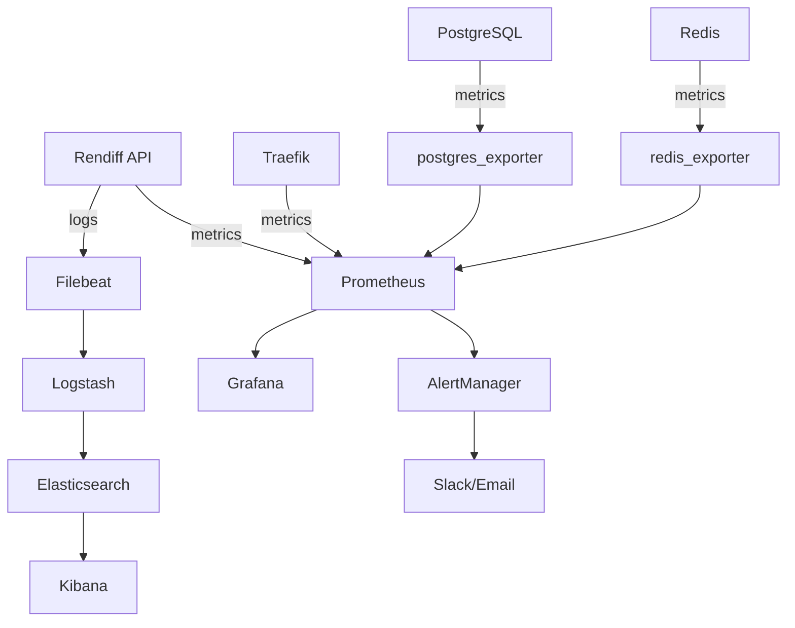

# Rendiff FFmpeg API - Comprehensive Monitoring Guide

## Overview

This guide covers the complete monitoring infrastructure for the Rendiff FFmpeg API, including metrics collection, alerting, log aggregation, and SLA monitoring.

## Table of Contents

1. [Architecture Overview](#architecture-overview)
2. [Metrics Collection](#metrics-collection)
3. [Dashboards](#dashboards)
4. [Alerting](#alerting)
5. [Log Aggregation](#log-aggregation)
6. [SLA Monitoring](#sla-monitoring)
7. [Deployment](#deployment)
8. [Troubleshooting](#troubleshooting)
9. [Best Practices](#best-practices)

## Architecture Overview

### Components



### Service Dependencies

| Service | Purpose | Port | Dependencies |
|---------|---------|------|--------------|
| **Prometheus** | Metrics collection & storage | 9090 | None |
| **Grafana** | Visualization & dashboards | 3000 | Prometheus |
| **AlertManager** | Alert routing & notifications | 9093 | Prometheus |
| **Elasticsearch** | Log storage & search | 9200 | None |
| **Logstash** | Log processing | 5044, 5000 | Elasticsearch |
| **Kibana** | Log visualization | 5601 | Elasticsearch |
| **Filebeat** | Log shipping | - | Logstash |

## Metrics Collection

### Prometheus Configuration

**Location**: `/monitoring/prometheus.yml`

```yaml
scrape_configs:
  - job_name: 'rendiff-api'
    static_configs:
      - targets: ['api:9000']
    scrape_interval: 15s
    metrics_path: /metrics
    
  - job_name: 'traefik'
    static_configs:
      - targets: ['traefik:8080']
    scrape_interval: 15s
    
  - job_name: 'postgres-exporter'
    static_configs:
      - targets: ['postgres-exporter:9187']
    scrape_interval: 30s
    
  - job_name: 'redis-exporter'
    static_configs:
      - targets: ['redis-exporter:9121']
    scrape_interval: 30s
```

### Business Metrics

The API exposes custom business metrics via the `/metrics` endpoint:

#### Job Processing Metrics
- `rendiff_jobs_total{status, job_type}` - Total jobs by status
- `rendiff_job_duration_seconds` - Job processing duration histogram
- `rendiff_jobs_completed_total{job_type}` - Completed jobs counter
- `rendiff_jobs_failed_total{job_type, error_type}` - Failed jobs counter

#### API Performance Metrics
- `rendiff_api_requests_total{method, endpoint, status_code}` - API requests
- `rendiff_api_request_duration_seconds` - Request duration histogram

#### Queue Metrics
- `rendiff_queue_depth{queue}` - Current queue depth
- `rendiff_workers_active{worker_type}` - Active worker count

#### Cache Metrics
- `rendiff_cache_hits_total{cache_type}` - Cache hits
- `rendiff_cache_misses_total{cache_type}` - Cache misses
- `rendiff_cache_operations_total{operation, result}` - Cache operations

### Custom Metrics Integration

To add custom metrics to your code:

```python
from api.services.metrics import get_business_metrics

metrics = get_business_metrics()

# Record job completion
metrics.record_job_completed(
    job_type="video_conversion",
    duration_seconds=45.2,
    worker_type="cpu"
)

# Record API request
metrics.record_api_request(
    method="POST",
    endpoint="/api/v1/convert",
    status_code=200,
    duration_seconds=0.15
)
```

## Dashboards

### Available Dashboards

#### 1. System Overview Dashboard
**File**: `/monitoring/dashboards/rendiff-system-overview.json`
**URL**: `http://grafana:3000/d/rendiff-system`

**Panels**:
- System Health Overview (API, Database, Redis status)
- API Performance (Request rate, Response time)
- Error Rates & Status Codes
- Resource Usage (CPU, Memory, Disk I/O)

#### 2. Job Processing Dashboard
**File**: `/monitoring/dashboards/rendiff-job-processing.json`
**URL**: `http://grafana:3000/d/rendiff-jobs`

**Panels**:
- Job Statistics (Queued, Processing, Completed, Failed)
- Processing Performance (Completion rate, Duration)
- Queue & Worker Status
- Error Analysis

#### 3. SLA Monitoring Dashboard
**File**: `/monitoring/dashboards/rendiff-sla-monitoring.json`
**URL**: `http://grafana:3000/d/rendiff-sla`

**Panels**:
- Availability gauges (24h, 7d, 30d)
- Response time SLA tracking
- Job success rate monitoring
- Error budget analysis

### Dashboard Import

To import dashboards:

1. Access Grafana: `http://localhost:3000`
2. Login with admin credentials
3. Go to "+" → Import
4. Upload the JSON files from `/monitoring/dashboards/`

## Alerting

### Alert Rules

**File**: `/monitoring/alerts/rendiff-alerts.yml`

#### Critical Alerts
- **APIDown**: API service unavailable
- **DatabaseDown**: PostgreSQL unavailable
- **RedisDown**: Redis unavailable
- **CriticalDiskSpace**: Disk usage > 95%
- **NoActiveWorkers**: No workers processing jobs

#### Warning Alerts
- **APIHighErrorRate**: 5xx error rate > 5%
- **APIHighLatency**: 95th percentile > 2s
- **HighJobFailureRate**: Job failure rate > 10%
- **LowCacheHitRate**: Cache hit rate < 70%

### AlertManager Configuration

**File**: `/monitoring/alerts/alertmanager.yml`

```yaml
route:
  group_by: ['alertname', 'cluster', 'service']
  routes:
  - match:
      severity: critical
    receiver: 'critical-alerts'
    repeat_interval: 5m
  - match:
      severity: warning  
    receiver: 'warning-alerts'
    repeat_interval: 30m

receivers:
- name: 'critical-alerts'
  slack_configs:
  - api_url: 'YOUR_SLACK_WEBHOOK'
    channel: '#ops-critical'
    title: 'CRITICAL: {{ .GroupLabels.alertname }}'
```

### Notification Channels

#### Slack Integration
1. Create Slack webhook in your workspace
2. Update `alertmanager.yml` with webhook URL
3. Configure channel routing by severity

#### Email Notifications
```yaml
email_configs:
- to: 'ops-team@company.com'
  subject: 'Alert: {{ .GroupLabels.alertname }}'
  body: |
    {{ range .Alerts }}
    {{ .Annotations.summary }}
    {{ .Annotations.description }}
    {{ end }}
```

## Log Aggregation

### ELK Stack Overview

The ELK (Elasticsearch, Logstash, Kibana) stack provides centralized logging:

#### Elasticsearch
- **Purpose**: Log storage and indexing
- **Indices**: 
  - `rendiff-api-*` - Application logs
  - `rendiff-traefik-*` - Access logs
  - `rendiff-worker-*` - Worker logs
  - `rendiff-postgres-*` - Database logs

#### Logstash
- **Purpose**: Log processing and transformation
- **Pipeline**: `/monitoring/logstash/pipeline/rendiff-logs.conf`
- **Features**:
  - JSON log parsing
  - Field extraction
  - GeoIP enrichment
  - Security analysis

#### Kibana
- **Purpose**: Log visualization and exploration
- **URL**: `http://localhost:5601`
- **Index Patterns**: `rendiff-*`

### Log Structure

#### Application Logs (JSON format)
```json
{
  "timestamp": "2025-07-10T10:30:00Z",
  "level": "INFO",
  "message": "Job processing completed",
  "job_id": "12345-67890",
  "user_id": "user123",
  "processing_time": 45.2,
  "component": "video_processor"
}
```

#### Access Logs (Traefik JSON format)
```json
{
  "time": "2025-07-10T10:30:00Z",
  "ClientAddr": "192.168.1.100:54321",
  "RequestMethod": "POST",
  "RequestPath": "/api/v1/convert",
  "DownstreamStatus": 200,
  "Duration": "150ms",
  "RequestContentSize": 1024,
  "DownstreamContentSize": 2048
}
```

### Filebeat Configuration

**File**: `/monitoring/filebeat/config/filebeat.yml`

```yaml
filebeat.inputs:
- type: container
  paths:
    - '/var/lib/docker/containers/*/*.log'
  processors:
  - add_docker_metadata:
      host: "unix:///var/run/docker.sock"

- type: log
  paths:
    - '/var/log/rendiff/*.log'
  fields:
    service: rendiff-api
  multiline.pattern: '^\{'
  multiline.negate: true
  multiline.match: after
```

### Common Log Queries

#### Kibana Query Examples

**Error logs in last hour:**
```
level:ERROR AND @timestamp:[now-1h TO now]
```

**Failed jobs:**
```
message:"Job processing failed" AND @timestamp:[now-24h TO now]
```

**High response times:**
```
Duration:>1000 AND @timestamp:[now-1h TO now]
```

**Security alerts:**
```
tags:security_alert AND @timestamp:[now-24h TO now]
```

## SLA Monitoring

### Service Level Objectives (SLOs)

| Metric | Target | Measurement Window |
|--------|--------|--------------------|
| **API Availability** | 99.9% | 30 days |
| **Response Time (95th percentile)** | < 2 seconds | 30 days |
| **Job Success Rate** | 95% | 30 days |

### Error Budget

- **Availability Error Budget**: 0.1% (43,200 errors per 30 days for 99.9% target)
- **Performance Error Budget**: 5% of requests may exceed 2s response time
- **Job Processing Error Budget**: 5% of jobs may fail

### SLA Breach Response

#### Critical Breach (Availability < 99%)
1. **Immediate**: Page on-call engineer
2. **5 minutes**: Incident commander assigned
3. **15 minutes**: War room established
4. **30 minutes**: Mitigation plan in progress

#### Warning Breach (Availability < 99.5%)
1. **Immediate**: Alert to ops team
2. **30 minutes**: Investigation begins
3. **2 hours**: Root cause analysis
4. **4 hours**: Preventive measures implemented

### SLA Reporting

Monthly SLA reports are generated automatically and include:
- Availability percentages
- Performance metrics
- Error budget consumption
- Incident summary
- Improvement recommendations

## Deployment

### Quick Start

1. **Start monitoring stack:**
```bash
# Basic monitoring (Prometheus + Grafana)
docker-compose --profile monitoring up -d

# Full ELK stack
docker-compose -f docker-compose.yml -f docker-compose.elk.yml up -d
```

2. **Import dashboards:**
```bash
# Copy dashboard files to Grafana
docker cp monitoring/dashboards/ rendiff-grafana:/var/lib/grafana/dashboards/
docker restart rendiff-grafana
```

3. **Configure alerts:**
```bash
# Copy alert rules to Prometheus
docker cp monitoring/alerts/rendiff-alerts.yml rendiff-prometheus:/etc/prometheus/alerts/
docker restart rendiff-prometheus
```

### Production Deployment

#### Environment Variables

```bash
# Monitoring configuration
ENABLE_METRICS=true
METRICS_PORT=9000
PROMETHEUS_RETENTION=30d
GRAFANA_ADMIN_PASSWORD=secure_password

# ELK Stack configuration  
ELASTICSEARCH_HEAP_SIZE=2g
LOGSTASH_HEAP_SIZE=1g
KIBANA_ENCRYPTION_KEY=your_32_char_encryption_key

# Alert configuration
SLACK_WEBHOOK_URL=https://hooks.slack.com/...
ALERT_EMAIL=ops@company.com
```

#### Resource Requirements

| Service | CPU | Memory | Disk |
|---------|-----|--------|------|
| **Prometheus** | 2 cores | 4GB | 100GB |
| **Grafana** | 1 core | 2GB | 10GB |
| **Elasticsearch** | 4 cores | 8GB | 500GB |
| **Logstash** | 2 cores | 4GB | 20GB |
| **Kibana** | 1 core | 2GB | 10GB |

#### Security Configuration

```yaml
# Grafana security
GF_SECURITY_ADMIN_PASSWORD: ${GRAFANA_ADMIN_PASSWORD}
GF_SECURITY_SECRET_KEY: ${GRAFANA_SECRET_KEY}
GF_SECURITY_DISABLE_GRAVATAR: true

# Elasticsearch security
xpack.security.enabled: true
xpack.security.transport.ssl.enabled: true
```

### Health Checks

Verify monitoring stack health:

```bash
# Check Prometheus targets
curl http://localhost:9090/api/v1/targets

# Check Grafana health
curl http://localhost:3000/api/health

# Check Elasticsearch cluster
curl http://localhost:9200/_cluster/health

# Check Kibana status
curl http://localhost:5601/api/status
```

## Troubleshooting

### Common Issues

#### Prometheus Not Scraping Metrics

**Symptoms**: Missing data in Grafana dashboards
**Causes**: 
- Service discovery issues
- Network connectivity
- Wrong metrics endpoint

**Solution**:
```bash
# Check Prometheus targets
curl http://localhost:9090/api/v1/targets

# Check service connectivity
docker exec rendiff-prometheus wget -qO- http://api:9000/metrics

# Verify metrics endpoint
curl http://localhost:9000/metrics
```

#### High Memory Usage in Elasticsearch

**Symptoms**: Out of memory errors, slow queries
**Causes**: 
- Too much heap allocation
- Large number of indices
- Heavy aggregation queries

**Solution**:
```bash
# Check memory usage
curl http://localhost:9200/_cat/nodes?v&h=name,heap.percent,ram.percent

# Adjust heap size
ES_JAVA_OPTS="-Xms4g -Xmx4g"

# Clean old indices
curl -X DELETE http://localhost:9200/rendiff-*-2025.06.*
```

#### Grafana Dashboard Loading Slowly

**Symptoms**: Slow dashboard rendering
**Causes**:
- Complex queries
- Large time ranges
- Too many data points

**Solution**:
- Optimize Prometheus queries
- Use recording rules for complex calculations
- Implement dashboard caching
- Reduce data retention for high-cardinality metrics

#### Missing Logs in Kibana

**Symptoms**: No logs appearing in Kibana
**Causes**:
- Filebeat not shipping logs
- Logstash parsing errors
- Elasticsearch indexing issues

**Solution**:
```bash
# Check Filebeat status
docker logs rendiff-filebeat

# Check Logstash pipeline
docker logs rendiff-logstash | grep ERROR

# Verify Elasticsearch indices
curl http://localhost:9200/_cat/indices?v
```

### Performance Optimization

#### Prometheus Optimization

```yaml
# Recording rules for complex queries
groups:
- name: rendiff_recording_rules
  interval: 30s
  rules:
  - record: rendiff:api_availability_5m
    expr: |
      (
        1 - (
          sum(rate(traefik_service_requests_total{service=~".*rendiff-api.*",code=~"5.."}[5m])) /
          sum(rate(traefik_service_requests_total{service=~".*rendiff-api.*"}[5m]))
        )
      ) * 100
```

#### Elasticsearch Optimization

```yaml
# Index lifecycle management
PUT _ilm/policy/rendiff-logs-policy
{
  "policy": {
    "phases": {
      "hot": {
        "actions": {
          "rollover": {
            "max_size": "10GB",
            "max_age": "7d"
          }
        }
      },
      "warm": {
        "min_age": "7d",
        "actions": {
          "allocate": {
            "number_of_replicas": 0
          }
        }
      },
      "delete": {
        "min_age": "30d"
      }
    }
  }
}
```

### Maintenance Tasks

#### Daily Tasks
- Check alert status
- Review error budget consumption
- Verify backup completion

#### Weekly Tasks
- Review dashboard performance
- Update alert thresholds
- Clean up old logs
- Check storage usage

#### Monthly Tasks
- Generate SLA reports
- Review and update monitoring strategy
- Performance optimization
- Security review

## Best Practices

### Metrics Best Practices

1. **Naming Convention**: Use `rendiff_` prefix for all custom metrics
2. **Labels**: Keep cardinality low, avoid user IDs in labels
3. **Histogram Buckets**: Choose buckets that make sense for your use case
4. **Recording Rules**: Pre-calculate complex queries

### Alerting Best Practices

1. **Alert Fatigue**: Set appropriate thresholds to avoid noise
2. **Runbooks**: Include runbook links in alert annotations
3. **Escalation**: Define clear escalation paths for different severities
4. **Testing**: Regularly test alert delivery mechanisms

### Dashboard Best Practices

1. **User-Focused**: Design dashboards for specific audiences
2. **Performance**: Optimize queries for fast loading
3. **Templates**: Use variables for dynamic filtering
4. **Standards**: Follow consistent design patterns

### Log Management Best Practices

1. **Structured Logging**: Use JSON format for machine parsing
2. **Log Levels**: Use appropriate log levels (DEBUG, INFO, WARN, ERROR)
3. **Correlation IDs**: Include correlation IDs for request tracing
4. **Retention**: Set appropriate retention policies

### Security Best Practices

1. **Access Control**: Implement role-based access to monitoring tools
2. **Sensitive Data**: Avoid logging sensitive information
3. **Network Security**: Secure monitoring endpoints
4. **Audit Logging**: Log access to monitoring systems

## Additional Resources

- [Prometheus Documentation](https://prometheus.io/docs/)
- [Grafana Documentation](https://grafana.com/docs/)
- [Elasticsearch Guide](https://www.elastic.co/guide/en/elasticsearch/reference/current/index.html)
- [SLI/SLO Best Practices](https://sre.google/sre-book/service-level-objectives/)

## Support

For monitoring-related issues:
1. Check this documentation
2. Review logs and metrics
3. Contact the DevOps team
4. Create an issue in the monitoring repository